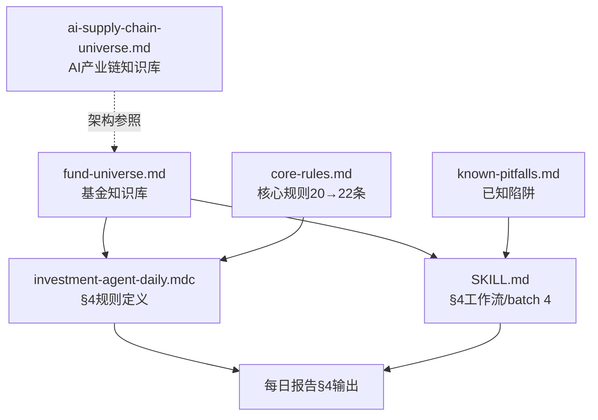

## 用户需求

大老板建议升级投资Agent每日策略简报的第四部分（§4 基金&大资金动向），核心要求：扩展头部基金覆盖范围，追踪基金负责人和策略师核心观点，不遗漏重要信息。

## 产品概述

基于大老板提供的《头部基金25H1持仓情况_v2.pdf》（9页），对§4基金&大资金动向模块进行系统性升级。当前§4仅覆盖10大核心机构，且缺少独立的基金知识库、扫描力度不足（batch 4仅1-2次web_search）、策略师/CIO核心观点追踪缺失。

## 核心功能

### 1. 新建基金知识库（fund-universe.md）

类似已有的`ai-supply-chain-universe.md`架构，新建头部基金全景知识库，涵盖PDF中所有基金：

- **被动巨头**：Vanguard（$6.93T/4280只）、BlackRock（$6.24T/5373只/BTC ETF IBIT）
- **价值投资**：Berkshire Hathaway（$294.3B/36只/Top10占81.3%）、段永平H&H Investment（$12B/11只/苹果63%+伯克希尔15%+拼多多7.6%）
- **宏观策略**：Bridgewater（$21.55B/664只/大幅增持阿里/黄金/Booking）
- **另类资产**：Blackstone（$16.65B/169只/能源为主/建仓GPU服务CRWV）
- **前沿科技**：ARK Invest（$14.1B/192只/加密+基因编辑+AI医疗）
- **量化多策略**：Millennium（$103.01B/3907只）、Citadel、Point72、D.E. Shaw、Two Sigma、Renaissance、AQR
- **事件驱动/其他**：Elliott、TCI、Marshall Wace、Balyasny、Schonfeld、Exoduspoint、Man Group
- **中国/亚太**：Hillhouse、FengHe、TAL China Focus
- 包含每家基金的AUM、持仓数、集中度、Turnover率、代表人物、投资策略、25H1回报表现

### 2. 扩展§4机构覆盖范围

- 从10大核心机构扩展为「三梯队」体系：一级核心（大老板关联+超大AUM）、二级追踪（顶级对冲基金）、三级雷达（事件驱动/区域基金）
- 新增段永平H&H Investment（大老板已汇报标的中含BRK.B和PDD，段永平重仓这两个标的，高度关联）
- 新增PDF中出现但当前缺失的全部对冲基金

### 3. 策略师/CIO核心观点追踪机制

- 每家一级核心机构配对应的策略师/CIO/PM清单
- 明确追踪哪些公开发言渠道（年度信/季度信/媒体采访/会议演讲/社交媒体）
- 追踪内容从"13F持仓变动"扩展为"持仓+观点+策略信号"三位一体

### 4. batch 4扫描流程升级

- 从1-2次web_search升级为系统化多步扫描（13F + 公开发言 + 策略报告 + 资金流）
- 与fund-universe.md知识库联动，类似batch 0b与ai-supply-chain-universe.md的联动模式

### 5. §4格式不动

- 保留当前的表格（机构/人物 | 动态 | 投资含义）+ 动向解读段落
- 仅扩展覆盖面和扫描深度

## 技术栈

- 文件类型：Markdown知识库文件 + MDC规则文件
- 项目：投资Agent每日策略简报规则系统（`.codebuddy/rules/` + `.codebuddy/skills/`）
- 架构模式：知识库驱动的规则引擎（知识库md → 规则mdc → 工作流SKILL.md → references/辅助文件）

## 实现方案

### 整体策略

采用与§3 AI产业链知识库（`ai-supply-chain-universe.md`）完全一致的架构模式，新建`fund-universe.md`作为§4的知识库底座，然后在`.mdc`规则文件和`SKILL.md`工作流中联动引用。这是已验证成功的模式（v17.5 RULE THREE第7条），直接复用。

### 关键技术决策

1. **知识库架构**：参照`ai-supply-chain-universe.md`的6大分区结构（供应商表→中国链→海外链→大模型→已汇报标的→扫描指南），`fund-universe.md`设计为：一级核心机构详情→二级对冲基金→三级雷达→策略师/CIO追踪清单→25H1回报表现→batch 4扫描指南

2. **三梯队覆盖体系**：

- **一级核心**（有动态必报，7-8家）：Berkshire/BlackRock/Vanguard/Bridgewater/Blackstone/ARK/段永平H&H + Hillhouse
- **二级追踪**（季度13F+重大发言必报，10-12家）：Millennium/Citadel/Point72/D.E.Shaw/Two Sigma/Renaissance/Elliott/TCI/AQR
- **三级雷达**（有重大事件才报，8-10家）：Marshall Wace/Balyasny/Schonfeld/Exoduspoint/Man Group/FengHe/TAL China Focus等

3. **batch 4升级**：从1-2次web_search升级为3-5次分步扫描（13F/持仓变动→策略师发言/观点→北向/南向资金→基金回报/业绩→知识库联动检查）

4. **版本升级路径**：规则版本从v17.5→v17.6，标注为"基金&大资金深度覆盖版"

## 实现要点

- **新增段永平H&H Investment**：大老板已汇报标的中BRK.B和PDD均为段永平重仓股（苹果63%+伯克希尔15%+拼多多7.6%），关联度极高，必须升级为一级核心
- **25H1回报表现数据**：PDF第9页的对冲基金回报数据作为基线参考写入知识库，但每日报告中引用需以实时搜索为准（RULE ZERO）
- **策略师追踪清单**：每家一级机构配1-2个核心人物+追踪渠道，确保搜索有方向
- **RULE FOUR候选**：考虑新增RULE FOUR（基金&大资金覆盖完整性铁律），与RULE THREE对AI产业链的覆盖逻辑对称，但鉴于§4是"有事才说"模式（非每日必出），改为在RULE THREE中新增第9条子规则更为合理，避免规则膨胀
- **向后兼容**：§4的输出格式（表格+动向解读）完全不变，只扩展输入端（覆盖面+扫描深度）

## 架构设计

### 文件依赖关系



### 数据流

用户触发投资Agent → batch 4扫描（参照fund-universe.md三梯队清单）→ 13F/持仓+策略师发言+资金流+业绩 → §4表格+动向解读

## 目录结构

```
.codebuddy/skills/investment-agent-daily/references/
├── fund-universe.md                    # [NEW] 头部基金&大资金知识库。包含三梯队机构详情（一级核心8家/二级追踪10家/三级雷达8家），每家基金含AUM/持仓数/集中度/Turnover/代表人物/投资策略/25H1回报。含策略师/CIO追踪清单。含batch 4扫描指南。架构参照ai-supply-chain-universe.md。
├── ai-supply-chain-universe.md         # [UNCHANGED] AI产业链知识库
├── core-rules.md                       # [MODIFY] 核心规则从20条→22条，新增2条§4覆盖规则（基金知识库联动+策略师观点追踪）
├── known-pitfalls.md                   # [MODIFY] 新增§4相关陷阱（基金覆盖盲区/策略师发言遗漏/13F时效性误判/一级机构动态遗漏等）
└── rule-zero.md                        # [UNCHANGED]

.codebuddy/rules/
└── investment-agent-daily.mdc          # [MODIFY] §4覆盖范围从10大→三梯队27家；新增段永平H&H；新增策略师追踪机制；新增基金知识库联动规则（参照RULE THREE第7条模式）；batch 4从1-2次→3-5次；版本v17.5→v17.6

.codebuddy/skills/investment-agent-daily/
└── SKILL.md                            # [MODIFY] §4工作流同步升级：batch 4扫描流程从1-2次→3-5次分步扫描；10大核心机构→三梯队；新增策略师追踪；核心规则20→22条；终审15→17项；版本v17.5→v17.6
```

## Agent Extensions

### Skill

- **investment-agent-daily**
- 目的：本次修改的核心目标技能，需要升级其§4基金&大资金动向模块的覆盖范围和扫描深度
- 预期结果：§4从10大机构扩展为三梯队27家，新增基金知识库，batch 4扫描升级

### SubAgent

- **code-explorer**
- 目的：在修改多个关联文件时，验证跨文件引用一致性（如fund-universe.md在.mdc和SKILL.md中的引用路径）
- 预期结果：确保所有文件间的引用路径、版本号、规则编号一致无冲突