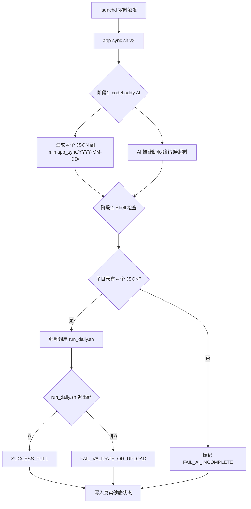

## 用户需求

修复投研鸭小程序自动化数据更新系统。小程序已经 6 天没有更新数据（最后成功上传：4月30日），需要：

1. 立即恢复小程序数据更新（生成今日 5/6 数据并上传到微信云数据库）
2. 重写自动化脚本 `app-sync.sh`，解决"AI 被 token 截断但脚本仍报成功"的致命设计缺陷
3. 更新 SKILL.md 加入自我守卫约束，降低 AI 漏执行 Phase 3 的概率
4. 恢复 launchd 定时任务

## 产品概览

投研鸭小程序通过 launchd 定时触发 codebuddy AI 自动生成 4 个结构化 JSON（briefing/markets/watchlist/radar），经 run_daily.sh 校验+补全后上传微信云数据库，小程序前端实时读取展示。

## 核心特性

- 双阶段守卫：AI 生成 JSON（阶段1）+ Shell 层强制调用 run_daily.sh（阶段2），即使 AI 被截断，脚本也能自动完成后续链路
- 真实健康状态：健康日志反映实际上传结果，而非 codebuddy 进程退出码
- 自我守卫约束：SKILL.md Phase 3 明确"不可省略"指令，降低 AI 主动跳过的概率

## 技术栈

- Shell（Bash）：`app-sync.sh` 自动化脚本
- Python 3：validate.py / auto_compute.py / upload_to_cloud.py / refresh_verified_snapshot.py
- macOS launchd：定时任务调度
- codebuddy CLI：AI Agent 调用
- 微信云数据库：数据存储终端

## 实现方案

### 核心策略：双阶段守卫架构

将 `app-sync.sh` 从"单阶段依赖 AI 完整执行"重构为"双阶段分离守卫"：

- **阶段 1**：调用 codebuddy 让 AI 生成 4 个 JSON 文件到日期子目录
- **阶段 2**：Shell 层独立判断 JSON 完整性，若满足条件则强制调用 `run_daily.sh` 完成校验+上传

**关键决策**：

1. 删除"只刷 generatedAt"的虚假兜底（Bug #3 根因），避免指标失真
2. 不再依赖 codebuddy 退出码判断成功（退出码 0 不等于流程完成）
3. 健康日志细分为 4 种状态：`SUCCESS_FULL` / `FAIL_AI_INCOMPLETE` / `FAIL_VALIDATE` / `FAIL_NETWORK`

### 性能与可靠性

- run_daily.sh 本身已有完善的校验链（JSON语法→auto_compute→validate→sparkline→upload），Shell 层兜底不影响数据质量
- 超时仍保留 7200 秒（2小时），但新增"AI 阶段超时"细化（若 AI 30 分钟内未产出，提前进入阶段 2 检查）

## 实现注意事项

1. **兼容性**：`run_daily.sh` 内部第 -1 步已具备"日期子目录→根目录同步"功能，Shell 层只需检查子目录文件数并调用即可
2. **环境变量**：`run_daily.sh` 依赖 `WX_APPID` / `WX_APPSECRET` / `WX_CLOUD_ENV`，这些已在 launchd plist 的 EnvironmentVariables 中配置，Shell 层执行时自动继承
3. **日志隔离**：阶段 2 的日志追加到同一个 `$LOG_FILE`，便于单次执行完整追溯
4. **避免重复上传**：如果 AI 已经成功调用了 run_daily.sh（极少数情况），Shell 层再次调用会触发云数据库"更新"而非"新增"，不产生副作用

## 架构设计



## 目录结构

```
~/.local/bin/
└── app-sync.sh                    # [MODIFY] v2 双阶段守卫重写：删除虚假 generatedAt 兜底，新增 Shell 层强制 run_daily.sh 调用，健康日志改为真实状态

~/Desktop/AICo/codebuddy-invest/
├── .codebuddy/skills/touyanduck-daily/
│   └── SKILL.md                   # [MODIFY] v11.4 → v11.5：Phase 3 加入自我守卫约束，明确"不可因 token 接近上限而省略 run_daily.sh 调用"
└── workflows/investment_agent_data/miniapp_sync/
    ├── 2026-05-06/                # [NEW] 今日数据（由 Skill 生成）
    │   ├── briefing.json
    │   ├── markets.json
    │   ├── watchlist.json
    │   └── radar.json
    ├── briefing.json              # [MODIFY] 经 run_daily.sh 处理后的最终版本
    ├── markets.json               # [MODIFY] 同上
    ├── watchlist.json             # [MODIFY] 同上
    └── radar.json                 # [MODIFY] 同上
```

## Agent Extensions

### Skill

- **touyanduck-daily**
- 用途：执行今日（2026-05-06）完整数据生产流程，生成 4 个 JSON 并上传微信云数据库，立即恢复小程序数据可用性
- 预期结果：小程序前端刷新后显示 5/6 最新数据，"6天前"变为"刚刚"