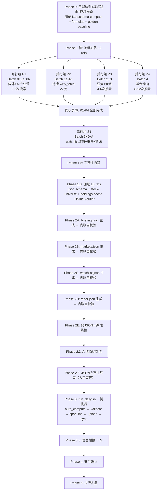

## 用户需求

对 `.codebuddy/skills/investment-agent-daily-app/` Skill 进行架构改造，从 v10.6 升级到 v11.0，引入"局部并行 + 单 Agent 主控 + 脚本分离"方案。

## 产出概述

投研鸭小程序数据生产 Skill 的规范文档全面升级，引入四大新机制，同时确保质量 100% 复刻、工具链零改动。

## 核心特性

1. **Phase 1 并行采集**：将原串行 10 批次采集改为 4 组并行 + 1 组串行，采集时间预期减少 60-70%
2. **Context 压缩铁律**：为每个采集批次定义精确的"最小字段集"提取规范，web_fetch/web_search 后立即提取结构化字段丢弃原始 HTML/snippet，Phase 1 上下文从约 76k 压缩至约 35k
3. **References 分层按需加载**：将原 Phase 0 一次性加载所有 16 个 refs 改为三批按需加载（Phase 0 加载 3 个核心 refs、Phase 1.8 补读采集知识库、Phase 2 前补读 Schema），每阶段只加载必需上下文
4. **Generator-Verifier 内联自校验**：Phase 2 每生成一个 JSON 立即执行内联校验（从 validate.py 17 项 FATAL 中提取可在写入时检测的子集），避免 Phase 3 FATAL 后整体重来

## 硬性约束

- 工具链零改动：auto_compute.py / validate.py / run_daily.sh / upload_to_cloud.py / refresh_verified_snapshot.py / generate_audio.py / sync_to_edgeone.sh 全部不改
- JSON Schema 零改动：json-schema.md / golden-baseline.json / schema-compact.json / templates/ 不改
- 知识库零改动：stock-universe.md / fund-universe.md / ai-supply-chain-universe.md / media-watchlist.md / holdings-cache.json 不改
- 九大铁律（RULE ZERO ~ RULE EIGHT）全部保持
- 54 项校验 / 17 项 FATAL 全部保持
- 4 个 JSON 产出物格式完全兼容

## 涉及文件清单

| 文件                                | 操作     | 说明                                                                      |
| ----------------------------------- | -------- | ------------------------------------------------------------------------- |
| SKILL.md                            | [MODIFY] | v10.6 -> v11.0，重写工作流章节、新增 3 大机制章节、更新引用索引为分层加载 |
| references/data-collection-sop.md   | [MODIFY] | v2.1 -> v3.0，新增并行分组规范 + 最小字段集提取规范                       |
| references/inline-verifier-rules.md | [NEW]    | Generator-Verifier 内联自校验完整规则清单                                 |
| references/known-pitfalls.md        | [MODIFY] | v4.5 -> v5.0，新增并行采集相关堵点                                        |
| CHANGELOG.md                        | [MODIFY] | 新增 v11.0 完整变更记录                                                   |
| README.md                           | [MODIFY] | 更新架构说明和版本号                                                      |

## 技术栈

- 文档格式：Markdown（.md）
- 产出类型：CodeBuddy Skill 规范文档
- 核心约束：只改规范文档，不改任何 Python/Bash 脚本和 JSON Schema

## 实现方案

### 整体策略

采用"规范驱动"的改造方式——通过修改 SKILL.md 主控文档和 references/ 下的规范文件，在 AI 执行层面引入并行采集、Context 压缩、分层加载和内联自校验四大机制。工具链完全不动，所有改造通过"指导 AI 行为的文档"实现。

### 关键技术决策

**决策 1：并行分组策略（4 组并行 + 1 组串行）**

按 context-centric decomposition 原则，划分依据是"每组需要的上下文是否独立"：

- 并行组 P1（batch 0+0a+0b）：媒体/AI产业链扫描——只需 media-watchlist.md + ai-supply-chain-universe.md
- 并行组 P2（batch 1a-1d）：行情数据 web_fetch——只需 Google Finance URL 模板，无知识库依赖
- 并行组 P3（batch 2+3）：亚太+大宗——只需行情源 URL，无交叉依赖
- 并行组 P4（batch 4）：基金动向——只需 fund-universe.md
- 串行组 S1（batch 5+6+A）：依赖 P2 的 GICS 结果选板块热点标的

这 4 组之间无数据依赖，可安全并行。S1 必须等 P1-P4 全部完成后才能启动。

**决策 2：Context 压缩——最小字段集的精确定义**

不用模糊描述，而是为每个批次定义精确的字段提取表（字段名+类型+示例），写入 data-collection-sop.md 作为强制规范。每次 web_fetch 后 AI 必须立即执行"提取→丢弃"操作，只保留结构化字段。

关键原则：

- 交易数据批次（P2/P3）：只保留 name/symbol/price(string)/change(number)/5D_prices[7]
- 媒体批次（P1）：只保留 title/source/url/date/summary(<=80字)
- 基金批次（P4）：只保留 fund_name/person/action(<=100字)/signal/source/url/date
- 绝对禁止保留原始 HTML/snippet 在上下文中

**决策 3：References 三批分层加载时序**

| 批次 | 时机                   | 加载文件                                                                                             | 理由                   |
| ---- | ---------------------- | ---------------------------------------------------------------------------------------------------- | ---------------------- |
| L1   | Phase 0（自动+手动）   | SKILL.md(自动) + schema-compact.json + formulas.md + golden-baseline.json                            | 核心铁律+公式+枚举受控 |
| L2   | Phase 1 前（按组按需） | data-collection-sop.md + data-source-priority.md + media-watchlist.md(P1用) + fund-universe.md(P4用) | 各并行组只读自己需要的 |
| L3   | Phase 2 前             | json-schema.md + stock-universe.md + holdings-cache.json + inline-verifier-rules.md                  | JSON 生成+自校验       |

Phase 4/5 使用 templates.md + known-pitfalls.md，但这些在交付阶段加载，不增加 Phase 1-2 的上下文负担。

**决策 4：Generator-Verifier 内联自校验规则提取**

从 validate.py 的 17 项 FATAL + 37 项 WARN 中，提取"可在 JSON 写入时即时检测"的子集。判定标准：该校验项是否只需要当前 JSON 文件的局部信息即可判断（不需要跨文件比对或外部数据源）。

可内联检测的 FATAL 项（11/17 项）：

- V24（Markdown 残留）、V41（globalReaction value 格式）、V42（generatedAt 非空）
- V43（price 非占位符）、V40（metrics 无空值）、V39（持仓 13F 合规）
- R1（topHoldings>=3）、R2（positions>=10）、R3（无"待更新"）
- V3 部分（change 是 number）、V5 部分（数组长度）

不可内联检测的 FATAL 项（6/17 项，必须等 Phase 3 脚本执行）：

- V6（sparkline[-1] vs price，需脚本补全后才有 sparkline）
- V44（sparkline 零值）、V45（price vs sparkline 数量级）、V46（chartData 零值）
- V35（audioUrl，需 Phase 3.5 TTS 执行后）
- V38（sparkline 趋势 vs change，需脚本补全后）、V_TL（红绿灯阈值，需 auto_compute 执行后）

## 实现要点

1. **并行分组的同步门禁**：Phase 1.5 完整性门禁必须在所有并行组完成后才执行——不允许任何组未完成就进入 JSON 生成阶段
2. **Context 压缩不能丢数据**：最小字段集的设计必须覆盖 JSON 生成所需的全部原始数据，压缩的是"HTML 噪音"不是"有用信息"
3. **内联自校验不替代 validate.py**：Generator-Verifier 是前置过滤，validate.py 仍然是终极门禁。两层防护，不是替代关系
4. **分层加载不遗漏关键 refs**：必须确保每个阶段所需的 reference 在该阶段已加载，用表格明确标注

### 架构设计



## 目录结构

```
.codebuddy/skills/investment-agent-daily-app/
├── SKILL.md                              # [MODIFY] v10.6→v11.0 主控文档。重写工作流章节（引入并行采集4组分组+同步门禁）；新增「Context压缩铁律」章节（最小字段集提取规范引用）；新增「References分层加载」章节（三批L1/L2/L3时序表）；新增「Generator-Verifier内联自校验」章节（引用inline-verifier-rules.md）；更新引用文件索引表格（每个ref标注加载批次L1/L2/L3）；更新规范健康度快照；更新Changelog为v11.0
├── README.md                             # [MODIFY] v9.0→v11.0 使用说明。更新版本号、架构描述（新增并行采集+Context压缩+内联自校验三大特性）、文件结构表格（新增inline-verifier-rules.md）
├── CHANGELOG.md                          # [MODIFY] 新增v11.0完整变更记录（Phase1并行+Context压缩+分层加载+Generator-Verifier四大改造条目、涉及文件清单、向后兼容声明）
├── references/
│   ├── data-collection-sop.md            # [MODIFY] v2.1→v3.0 采集SOP。新增§0.8「并行采集分组规范」（4组并行定义+同步屏障+依赖图+失败处理）；新增§0.9「Context压缩——最小字段集提取规范」（11个批次的精确字段提取表+示例+禁止事项）；各批次章节头部新增「并行组归属」和「提取字段集」标注
│   ├── inline-verifier-rules.md          # [NEW] v1.0 Generator-Verifier内联自校验规则。定义4个JSON各自的内联校验清单（从validate.py 17项FATAL提取可内联检测的11项+关键WARN项）；跨JSON一致性检规则（Phase 2E）；自校验不通过时的修复SOP（最多重试2次→报告失败项→进入Phase 3由validate.py终裁）；明确标注6项不可内联检测的FATAL（需等脚本执行）
│   └── known-pitfalls.md                 # [MODIFY] v4.5→v5.0 堵点清单。新增并行采集类堵点4条（#57并行组数据竞争/#58 Context压缩丢字段/#59 串行组S1等待超时/#60 内联自校验橡皮图章）
├── scripts/                              # [不改动] 全部脚本零改动
│   ├── auto_compute.py                   # 不改动
│   ├── validate.py                       # 不改动
│   ├── run_daily.sh                      # 不改动
│   ├── upload_to_cloud.py                # 不改动
│   ├── refresh_verified_snapshot.py       # 不改动
│   ├── generate_audio.py                 # 不改动
│   ├── sync_to_edgeone.sh               # 不改动
│   └── ...                               # 其他脚本均不改动
└── templates/                            # [不改动]
```

## Agent Extensions

### SubAgent

- **code-explorer**
- 用途：在改造 SKILL.md 和 data-collection-sop.md 时，需要精确引用 validate.py 中 17 项 FATAL 的代码位置和检测逻辑，以及 auto_compute.py 中 15 类自动计算字段的列表，确保 inline-verifier-rules.md 中的规则与脚本完全一致
- 预期产出：validate.py FATAL_CODES 集合、每项 FATAL 的检测函数签名和阈值参数、auto_compute.py 覆盖的字段清单

### Skill

- **investment-agent-daily-app**
- 用途：本 Skill 是改造对象，改造过程中需要反复参照 Skill 的完整规范体系（SKILL.md + 16个references），确保改造后的规范与现有工具链100%兼容
- 预期产出：改造后的 v11.0 Skill 规范文档集，通过现有 validate.py 54项校验零退化
