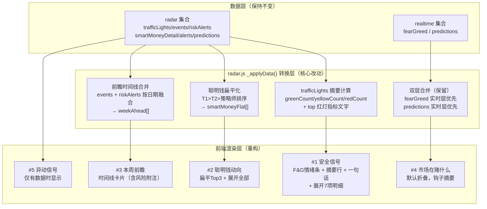

## 用户需求概述

基于与大老板用户的深度需求讨论，对投研鸭小程序第四页雷达页面进行**以用户价值为核心**的全面重构。

核心诉求：大老板持有大量配资，需要的不是信息堆砌，而是**高价值、低冗余、快速决策**的风险仪表盘。

## 产品概述

将雷达页从"技术指标展示板"重新定位为"投资风险决策仪表盘"。阅读路径对齐大老板的决策顺序：安不安全 → 聪明人怎么做 → 这周小心什么 → 市场在赌什么 → 有无异常信号。

## 核心改造内容

**模块重构（从8个精简为5个）**

- `#1 安全信号`：Fear & Greed 情绪条 + 7项指标摘要（"3绿3黄1红"一行展示）+ 一句话建议 + 点击展开7项明细
- `#2 聪明钱动向`：将原三梯队（T1旗舰/T2成长/策略师）扁平化，按重要性直排 Top3，可展开查看全部，提升到第2位（原第9位）
- `#3 本周前瞻`：将 events（关键事件日历）与 riskAlerts（风险预警）按时间线融合，有风险的事件直接附带概率+应对建议
- `#4 市场在赌什么`：原预测市场模块，改为默认折叠，标题旁显示最关键概率钩子，只展示与当周强相关的 2-3 条
- `#5 异动信号`：原异动监测，改名并仅在有异动时显示，无异动时整个模块隐藏

**废弃模块**

- 综合风险评分圆圈（与安全信号合并，不再单独展示）
- 关键监控阈值表（交易员作战手册，非大老板所需，移除渲染）

**数据层变更**

- JSON 结构向后兼容，主要靠前端 JS 转换逻辑处理，不破坏现有云函数
- Skill 规范同步更新：json-schema.md §4 重写 + SKILL.md 雷达页章节更新
- predictions 筛选规则固化到 Skill 生成规范（只选当周强相关 + 概率变化大的）

## 技术栈

- 微信小程序原生（WXML / WXSS / JS），延续现有项目架构
- 复用 `section-card`、`traffic-light`、`skeleton` 等已有组件
- 数据层：微信云数据库（双层合并：radar 集合 + realtime 集合）

## 实现策略

**向后兼容优先**：JSON 字段结构最小化改动，所有数据转换逻辑放在 `radar.js` 的 `_applyData()` 中处理，不改云数据库集合结构，不破坏现有 Skill 产出流程。

**前端驱动转换**：红绿灯摘要统计（greenCount/yellowCount/redCount）、聪明钱扁平化、时间线合并，全部在 JS 层计算，不依赖 JSON 新字段。

**渐进式降级**：每个新模块都有 `wx:if` 守卫，数据缺失时模块不渲染，不影响其他模块显示。

## 架构设计



## 关键代码结构

### radar.js _applyData() 新增转换逻辑

```js
// 1. 红绿灯摘要统计
var greenCount = 0, yellowCount = 0, redCount = 0
;(data.trafficLights || []).forEach(function(l) {
  if (l.status === 'green') greenCount++
  else if (l.status === 'yellow') yellowCount++
  else if (l.status === 'red') redCount++
})
var trafficSummary = greenCount + '绿' + yellowCount + '黄' + redCount + '红'

// 2. 聪明钱扁平化（T1>T2>策略师 tierOrder）
var tierOrder = { 'T1旗舰': 0, 'T2成长': 1, '策略师观点': 2 }
var smartMoneyFlat = []
;(data.smartMoneyDetail || []).forEach(function(tier) {
  var order = tierOrder[tier.tier] !== undefined ? tierOrder[tier.tier] : 9
  ;(tier.funds || []).forEach(function(fund) {
    smartMoneyFlat.push(Object.assign({}, fund, { tierOrder: order, tierLabel: tier.tier }))
  })
})
smartMoneyFlat.sort(function(a, b) { return a.tierOrder - b.tierOrder })

// 3. 前瞻时间线合并
var weekAhead = (data.events || []).map(function(e) {
  var impactInfo = colorUtil.getImpactInfo(e.impact)
  return { date: e.date, title: e.title, impact: e.impact,
    impactLabel: impactInfo.label, impactTagClass: impactInfo.tagClass,
    isRiskAlert: false, probability: '', response: '' }
})
;(data.riskAlerts || []).forEach(function(ra) {
  var impactInfo = colorUtil.getImpactInfo(ra.level === 'high' ? 'high' : 'medium')
  weekAhead.push({ date: '持续', title: ra.title, impact: ra.level,
    impactLabel: impactInfo.label, impactTagClass: impactInfo.tagClass,
    isRiskAlert: true, probability: ra.probability, response: ra.response })
})
```

## 实现注意事项

1. **现有动画保留**：F&G 数字跳动（`animateInteger`）、stagger 入场动画、安全信号圆圈动画均保留，仅移除风险评分圆圈动画（`_animTimer`）
2. **骨架屏同步**：`skeleton.wxml` 中 `type="radar"` 骨架屏模块顺序需与新渲染顺序对齐
3. **section-card 组件复用**：#4 预测市场改为 `expanded="{{false}}"` 默认折叠，标题通过 `title` 属性追加钩子文字
4. **Skill 文档同步**：json-schema.md §4 和 SKILL.md 必须在前端改完后同步更新，确保 AI 未来产出 radar.json 时符合新的展示逻辑（predictions 筛选规则、smartMoneyDetail 内容质量规范）

## 目录结构

```
touyanduck_appid/pages/radar/
├── radar.wxml    [MODIFY] 重构渲染顺序，新5模块布局，删除监控阈值和风险评分圆圈，新增安全信号模块/扁平聪明钱/时间线前瞻
├── radar.js      [MODIFY] _applyData() 新增摘要统计/扁平化/时间线合并逻辑，新增 data 字段（trafficSummary/smartMoneyFlat/weekAhead/smartMoneyShowAll）
└── radar.wxss    [MODIFY] 新增安全信号摘要行样式、时间线卡片样式、聪明钱扁平列表样式，删除不再使用的 monitor-table / risk-score 相关样式

.codebuddy/skills/investment-agent-daily-app/
├── references/json-schema.md    [MODIFY] §4 radar.json 重写：更新模块说明，monitorTable 降级为可选，新增 weekAhead/smartMoneyFlat 字段说明，固化 predictions 筛选规则
└── SKILL.md                     [MODIFY] 更新 radar.json 产出规范章节（v4.4），新增 predictions 内容筛选规范，更新聪明钱内容质量规范

workflows/investment_agent_data/miniapp_sync/
└── radar.json    [MODIFY] 以当前已有数据为基础更新示例数据，演示新字段结构，上传云数据库验证渲染效果
```

## 设计风格

雷达页整体延续投研鸭小程序现有设计语言（深色导航栏+白色内容区+金色强调色），在此基础上做信息密度优化，强调"层次感"和"快速扫读"。

## 页面结构

**#1 安全信号模块**
顶部区域，白色 section-card。上半部分保留现有 Fear & Greed 渐变情绪条（动画保留）+数字+标签+历史对比3项；下半部分新增一行摘要区：左侧3个小色块（绿/黄/红）+ 数字统计文字（"3绿3黄1红"），右侧一句话建议文字（来自 riskAdvice 内容精炼版）；最右侧一个"展开明细"箭头，点击在卡片内展开7项红绿灯详情（复用 traffic-light 组件）。

**#2 聪明钱动向模块**
位置提升至第2个。去掉三梯队分组标签，直接渲染扁平列表。每条：左侧信号灯圆点（红/绿/黄）+ 机构名（粗体）；右侧动向文字（灰色小字，2行内）。默认展示前3条，底部"展开全部 X条"按钮，点击展开剩余，使用 section-card 的 collapsible 机制实现。

**#3 本周前瞻模块**
时间线卡片设计。每条：左侧日期徽标（金色圆角矩形，"周一"/"周四"/"持续"等），右侧事件标题+影响等级标签（tag-red/tag-yellow）。若该事件有风险附注（来自 riskAlerts 的 probability+response），则在标题下方显示一行灰色小字："概率 45% - 若CPI超3.0%，提前将高PE科技降至标配"。

**#4 市场在赌什么模块**
默认折叠。section-card 标题区显示最关键一条概率作为钩子，例如："市场在赌什么  降息概率28% ↓"。展开后渲染 2-3 条预测进度条（与现有 pm-* 样式保持一致）。

**#5 异动信号模块**
与现有 alert-item 样式保持一致。无数据时整个模块不渲染（wx:if 守卫）。

## 交互细节

- 安全信号模块"展开明细"：点击箭头，卡片内 inline 展开红绿灯7项，无需跳转页面
- 聪明钱"展开全部"：点击按钮追加显示第4条起的所有条目，按钮变为"收起"
- 本周前瞻风险附注：默认全部展开（inline 在时间线条目内，不需要额外点击）
- 下拉刷新：保留现有 onPullDownRefresh 逻辑