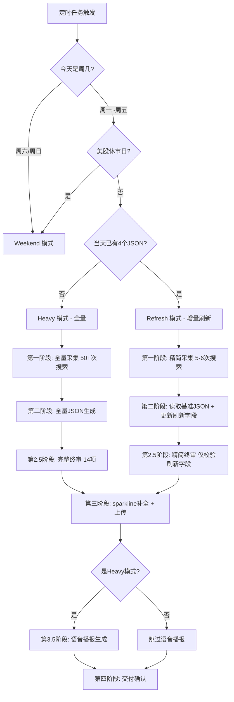
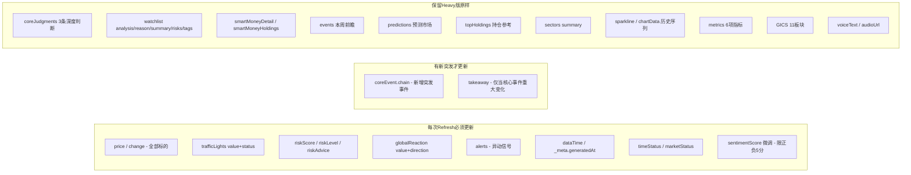

## 用户需求

投研鸭小程序数据生产频率从"每天一次全量"升级为"每4小时增量刷新"（北京时间 06:00/10:00/14:00/18:00/22:00），需要在现有 Skill 规范体系中新增 Refresh 模式，确保产出质量只提升不下降。

## 产品概述

在现有三档内容引擎（Heavy / Weekend / Live-TODO）基础上，新增第四档 Refresh 模式。06:00 执行 Heavy 全量产出作为当天"权威版"，后续 10:00/14:00/18:00/22:00 执行 Refresh 模式，读取当天 Heavy 版 JSON 为基准，只更新时效性强的字段（行情价格、红绿灯、异动信号等），保留深度分析内容不变。

## 核心特性

- 新增 Refresh 模式路由：当天 miniapp_sync 目录下已有 4 个 JSON 则走 Refresh，否则走 Heavy
- Refresh 精简采集批次（R0-R3，约3-4个batch，搜索次数5-6次）
- 明确的字段刷新/保留边界表：行情数据必刷、深度分析保留
- Refresh 精简终审门禁：只校验被更新的字段
- 语音播报仅在 Heavy 模式后生成，Refresh 跳过
- 新增 _meta.sourceType 枚举值 refresh_update
- 小程序前端零改动，JSON 结构不变

## 技术栈

- 文档格式：Markdown（SKILL.md 主控文档 + references/ 子文档）
- 数据格式：JSON（4 个结构化数据文件，Schema 不变）
- 脚本：Python（upload_to_cloud.py / run_daily.sh 不变）
- 前端：微信小程序原生（不改动）

## 实现方案

### 策略：分层刷新 + 最小改动

核心方法是在现有 Skill 规范体系上叠加一个 Refresh 模式定义，复用 Weekend 模式的"读取基准 JSON → 部分字段更新"架构模式，但刷新方向相反：Weekend 保留行情、更新分析；Refresh 更新行情、保留分析。

关键技术决策：

1. **模式路由判断**：采用方案A（简单判断），检查当天目录下是否已有 JSON 文件，而非读取 _meta 字段——简单可靠，避免增加复杂性
2. **字段边界设计**：将 4 个 JSON 的所有字段严格分为"刷新字段"和"保留字段"两类，Refresh 模式只覆盖刷新字段，保留字段从基准 JSON 原样拷贝，确保深度分析内容的一致性和质量
3. **采集批次精简**：Refresh 只执行 R0（快扫头条）+ R1（美股行情刷新）+ R2（亚太/大宗/加密行情刷新）+ R3（突发事件检查），搜索总量控制在 5-6 次 web_search + 0-2 次 web_fetch，远低于 Heavy 的 50+ 次
4. **终审精简**：Refresh 终审只校验被更新字段的数据类型、枚举值合规性和数字一致性，跳过深度内容质量门禁（B1-B12 / W1-W9 等），因为这些内容未被修改

### 为什么不大改现有架构

- Heavy 模式逻辑完全不动——当前 29 条致命错误 + 12 项终审门禁经过多轮实战验证，改动有引入回退风险
- Weekend 模式完全不动——周末逻辑独立成熟
- JSON Schema 不变——前端零改动，消除前后端联调风险
- 脚本（upload/sparkline 补全）不变——避免脚本层引入新 bug

## 实现要点

1. **Refresh 基准 JSON 不存在时的降级**：如果定时任务在 10:00 执行时发现当天没有 Heavy 版 JSON（如 06:00 任务失败），应自动降级为 Heavy 模式全量执行，而非 Refresh 失败退出。这一逻辑需在模式路由中明确。

2. **dataTime 统一标注**：Refresh 模式使用统一的 dataTime 格式（如 "2026-04-07 10:00 BJT"），不区分"行情更新时间"和"分析更新时间"，保持前端展示简洁。

3. **sparkline 一致性策略**：Refresh 模式下 sparkline 数组保持基准 JSON 不变（仍然是 7 天日线），price 字段单独刷新。sparkline[-1] 与 price 之间可能出现日内偏差（因 sparkline 是日级数据），这是可接受的——脚本在 Heavy 时已校准，日内偏差通常 <1%。

4. **搜索执行日志达标基线**：Refresh 模式新增独立基线（Refresh >= 4 次 web_search + 0 次 web_fetch），与 Heavy >= 10+1 / Weekend >= 8+1 区分，避免 Refresh 被误判为搜索不足。

5. **RULE SEVEN 聪明钱搜索豁免**：Refresh 模式不执行聪明钱 5 层搜索流程（Batch 4 完全跳过），聪明钱数据保留基准 JSON。这需要在 RULE SEVEN 中新增 Refresh 豁免说明。

## 架构设计

### 四档模式路由（升级后）



### Refresh 模式字段刷新范围



## 目录结构

```
.codebuddy/skills/investment-agent-daily-app/
  SKILL.md                              # [MODIFY] 主控文档 v6.1 -> v7.0：新增 Refresh 模式路由、采集批次引用、终审精简版、语音跳过说明、sourceType 枚举扩展、搜索基线扩展、RULE SEVEN 豁免
  references/
    refresh-mode.md                     # [NEW] Refresh 模式完整规范：设计哲学、精简采集批次(R0-R3)、字段刷新/保留边界表、4个JSON产出规则、精简终审门禁、工作流、关键约束
    data-collection-sop.md              # [MODIFY] v1.8 -> v1.9：新增第九章 Refresh 模式精简采集批次定义（R0-R3），不影响现有 Heavy 批次
    known-pitfalls.md                   # [MODIFY] v3.0 -> v3.1：新增堵点 #34(Refresh基准JSON不存在降级) #35(Refresh行情数据时态标注) #36(Refresh与Heavy字段边界误越)
    json-schema.md                      # [MODIFY] 极小改动：_meta.sourceType 枚举值新增 refresh_update
  README.md                             # [MODIFY] 极小改动：三档引擎描述更新为四档，新增 Refresh 行
```

## 使用的扩展

### Skill

- **investment-agent-daily-app**
- 用途：本次修改的目标 Skill，所有改动均围绕该 Skill 的规范文档体系进行
- 预期结果：Skill 从 v6.1 升级到 v7.0，新增 Refresh 模式支持

### SubAgent

- **code-explorer**
- 用途：在实施前确认 SKILL.md、data-collection-sop.md、known-pitfalls.md、json-schema.md 中需要精确插入修改的行号和段落位置
- 预期结果：精确定位所有修改点，避免误改现有逻辑