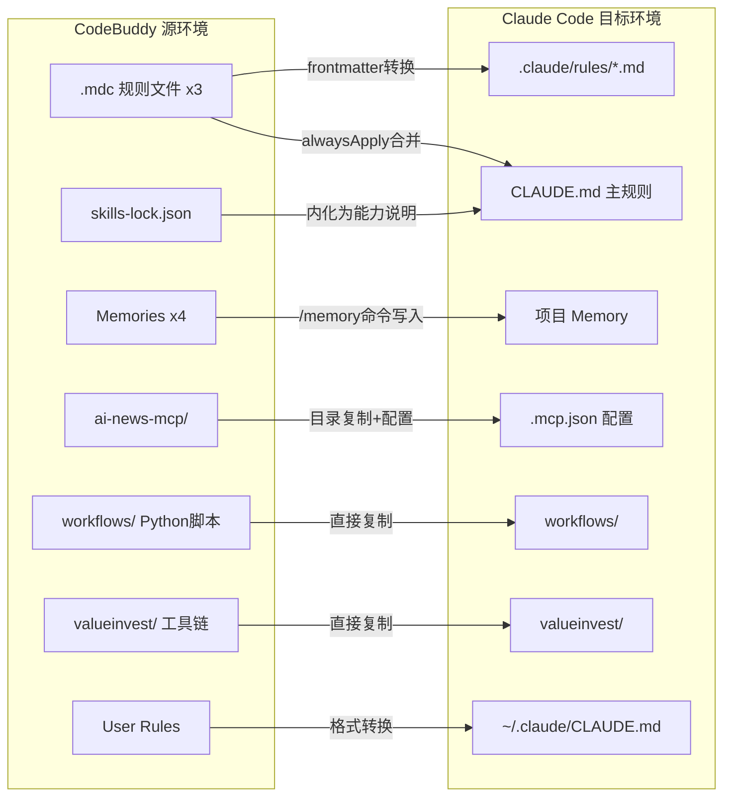

## 用户需求

将在 CodeBuddy 中已顺利运行的投资Agent每日策略报告（晨报/晚报）和价值投资Agent（个股深度分析）完整工作流，迁移到 Claude Code 环境中复现，包含PDF生成能力。

## 产品概述

这是一个跨AI编程工具的工作流迁移项目。用户在 CodeBuddy 中建立了一套成熟的投资分析报告自动化体系（含68条铁律、7阶段工作流、5种报告模板），现需要在 Claude Code 中完整复现，确保同等质量的报告产出。

## 核心功能

1. **规则文件迁移**：将3个 `.mdc` 规则文件（投资Agent v15.8 / 价值投资Agent v9.0 / PDF转换规则）转换为 Claude Code 的 `.md` 规则格式，保留全部68条铁律、7阶段工作流、5种报告模板
2. **Python工具链迁移**：迁移 `md_to_pdf.py`（两轮渲染法）、`chart_generator.py`（图表生成）等6个核心Python脚本及全部依赖
3. **MCP服务器迁移**：将 `ai-news-mcp` Node.js MCP服务器配置到 Claude Code 的 `.mcp.json`
4. **用户偏好迁移**：将4条永久记忆、用户自定义规则、质量标杆迁移到 Claude Code 对应位置
5. **产出完整的迁移操作手册**：一份可逐步执行的指南文档，用户照着操作即可完成全部迁移

## 技术栈

### 源环境（CodeBuddy）

- 规则文件：`.codebuddy/rules/*.mdc`（YAML frontmatter + Markdown body）
- 技能系统：`skills-lock.json`（16个技能）
- MCP：`ai-news-mcp/`（Node.js + TypeScript）
- Python工具链：`workflows/` 目录（6个核心脚本 + requirements.txt）
- 知识库：`workflows/investment_agent_data/`（6个JSON文件）
- 价值投资工具：`valueinvest/`（3个Python脚本 + 图表数据模板）

### 目标环境（Claude Code）

- 项目级主规则：`CLAUDE.md`（始终加载）
- 模块化规则：`.claude/rules/*.md`（按 description 触发条件按需加载）
- 全局用户规则：`~/.claude/CLAUDE.md`
- 本地规则：`CLAUDE.local.md`（不提交git）
- MCP配置：`.mcp.json`（项目级）
- Memory：通过 `/memory` 命令管理

## 实现方案

### 核心策略：分层迁移法

规则层 - 工具层 - MCP层 - 偏好层 - 验证层，每层独立可验证。

### 关键技术决策

#### 1. 规则文件格式转换（.mdc 转 .md）

**差异分析**：

| 维度 | CodeBuddy .mdc | Claude Code .md |
| --- | --- | --- |
| frontmatter | description / alwaysApply / enabled / updatedAt / provider | description / globs |
| 始终生效 | `alwaysApply: true` | 无 globs 字段（始终加载）或写入 CLAUDE.md |
| 条件触发 | `alwaysApply: false` + description 描述触发词 | description 字段描述触发条件 |
| 文件扩展名 | `.mdc` | `.md` |


**转换方案**：

| CodeBuddy 源文件 | Claude Code 目标 | 转换逻辑 |
| --- | --- | --- |
| `investment-agent-daily.mdc` (alwaysApply: false, 1724行) | `.claude/rules/investment-agent-daily.md` | frontmatter 仅保留 description，body 原文迁移 |
| `value-invest-agent.mdc` (alwaysApply: false, 1452行) | `.claude/rules/value-invest-agent.md` | frontmatter 仅保留 description，body 原文迁移 |
| `investment-report-pdf.mdc` (alwaysApply: true, 35行) | 合并写入 `CLAUDE.md` | 始终生效的规则直接写入主规则文件 |


#### 2. 规则文件体量处理

两个核心规则文件各133KB+，Claude Code 的 `.claude/rules/*.md` 按触发条件按需加载（非常驻内存），直接迁移全文不拆分，保持完整性。

#### 3. Skills 技能系统差异处理

CodeBuddy 16个技能中，投资相关核心技能的逻辑已完全内化在68条铁律中，无需单独迁移。在 CLAUDE.md 中注明能力等价说明（Claude Code 的 web_search/bash/Python 覆盖所有技能需求）。

#### 4. Python 依赖环境

`md_to_pdf.py` 的 weasyprint 在 macOS 需要系统级依赖：

```
brew install pango cairo gdk-pixbuf libffi
pip install markdown weasyprint pdfplumber pypdf
pip install -r workflows/requirements.txt
```

## 实现注意事项

1. **路径硬编码**：`investment-report-pdf.mdc` 中硬编码了 `/Users/zewujiang/Desktop/AICo/codebuddy/workflows`，CLAUDE.md 中需改为相对路径
2. **字体依赖**：macOS 环境 STHeiti/Hiragino Sans GB 系统自带，无需额外安装
3. **API Key**：`FRED_API_KEY` 和 `ALPHA_VANTAGE_KEY` 需在新环境设置
4. **模块引用链**：`valueinvest/generate_charts.py` 通过 `sys.path.insert` 引用 `workflows/chart_generator.py`，目录结构必须保持一致
5. **MCP build**：迁移后需 `cd ai-news-mcp && npm install && npm run build`

## 架构设计

### 迁移后项目目录结构

```
investment-agent/                        # Claude Code 新项目根目录
+-- CLAUDE.md                            # [NEW] 主规则（用户偏好+PDF规则+能力说明）
+-- CLAUDE.local.md                      # [NEW] 本地规则模板（API Key等，不提交git）
+-- .claude/
|   +-- rules/
|       +-- investment-agent-daily.md    # [NEW] 投资Agent v15.8 工作流（从.mdc转换）
|       +-- value-invest-agent.md        # [NEW] 价值投资Agent v9.0（从.mdc转换）
+-- .mcp.json                            # [NEW] MCP服务器配置
+-- ai-news-mcp/                         # [COPY] AI资讯MCP服务器
+-- workflows/                           # [COPY] Python工作流脚本（6个核心脚本）
|   +-- md_to_pdf.py / wf6_investment_agent.py / data_source_manager.py
|   +-- news_fetcher.py / mbb_report_engine.py / chart_generator.py
|   +-- requirements.txt
|   +-- investment_agent_data/           # 知识库JSON数据
+-- valueinvest/                         # [COPY] 价值投资工具链
|   +-- generate_charts.py / embed_charts_and_pdf.py / md_to_pdf.py
|   +-- chart_data_template.json / charts/
+-- scripts/
|   +-- setup.sh                         # [NEW] 环境初始化脚本
+-- docs/
    +-- 迁移操作手册-CodeBuddy到ClaudeCode-20260228.md  # [NEW] 完整迁移指南
```

### 迁移映射关系图



## Agent Extensions

### SubAgent

- **code-explorer**
- 用途：验证源项目完整文件结构和依赖关系
- 预期结果：确认所有需迁移文件路径和依赖链

### Skill

- **deep-research**
- 用途：搜索 Claude Code 最新规则系统文档（CLAUDE.md / .claude/rules / .mcp.json / Memory），确保迁移格式100%准确
- 预期结果：获取 Claude Code 官方文档中规则文件格式、frontmatter 规范、MCP 配置格式的最新信息